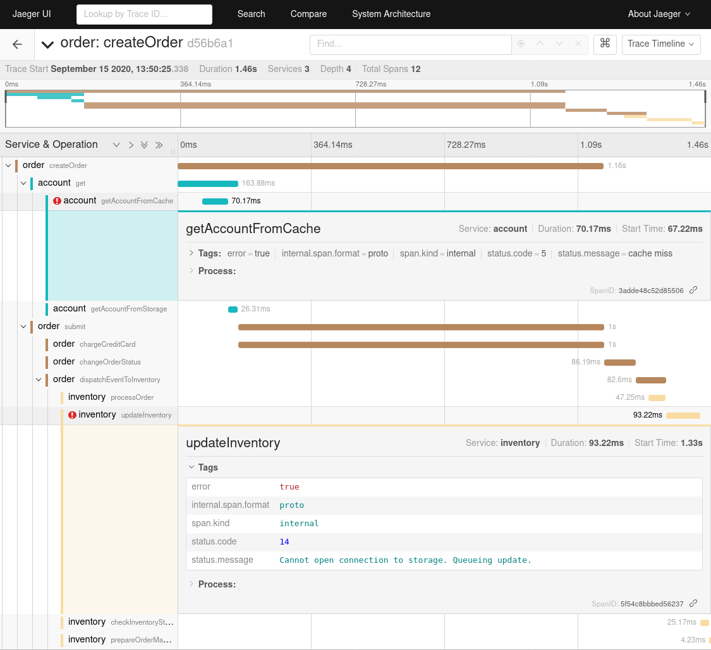

# OpenTelemetry Java SDK span generator

This is a Quarkus project that uses the OpenTelemetry Java SDK to generate traces. All traces are the same in structure but with random timings. Some actions are async, meaning that the order they appear in the trace might also differ.

## Running the application in dev mode

You can run your application in dev mode that enables live coding using:
```
./gradlew quarkusDev
```

You'll need an instance of OpenTelemetry Collector available on `localhost:55680`. When using a different endpoint, use env vars (`OTEL_OTLP_ENDPOINT=remote-host:55680`) or system properties (`-Dotel.otlp.endpoint=remote-host:55680`) to configure the tracer.

For all available options, check the OpenTelemetry Java SDK documentation.

Once the application is running, generate a trace by calling:

```
curl localhost:8080/order
```

When using Jaeger as the final destination for the trace, this is the expected outcome:



## Packaging and running the application

The application can be packaged using `./gradlew quarkusBuild`.
It produces the `generate-span-java-1.0.0-runner.jar` file in the `build` directory.
Be aware that it’s not an _über-jar_ as the dependencies are copied into the `build/lib` directory.

The application is now runnable using `java -jar build/generate-span-java-1.0.0-runner.jar`.

If you want to build an _über-jar_, just add the `--uber-jar` option to the command line:
```
./gradlew quarkusBuild --uber-jar
java -jar build/generate-span-java-1.0.0-runner.jar
```

## Creating a native executable

ATTENTION: this is not working at the moment. See https://github.com/open-telemetry/opentelemetry-java/issues/1645

You can create a native executable using: `./gradlew build -Dquarkus.package.type=native`.

Or, if you don't have GraalVM installed, you can run the native executable build in a container using: `./gradlew build -Dquarkus.package.type=native -Dquarkus.native.container-build=true`.

You can then execute your native executable with: `./build/generate-span-java-1.0.0-runner`

If you want to learn more about building native executables, please consult https://quarkus.io/guides/gradle-tooling#building-a-native-executable.